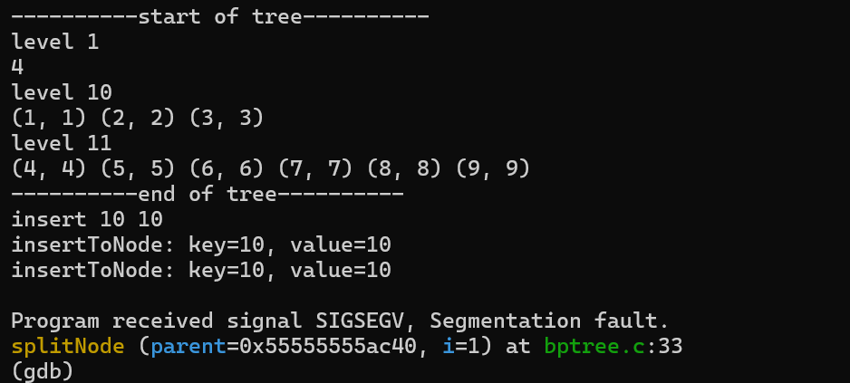
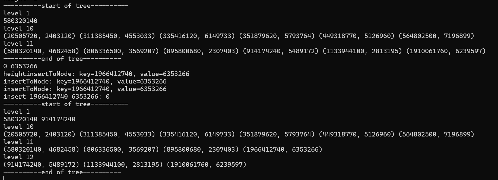
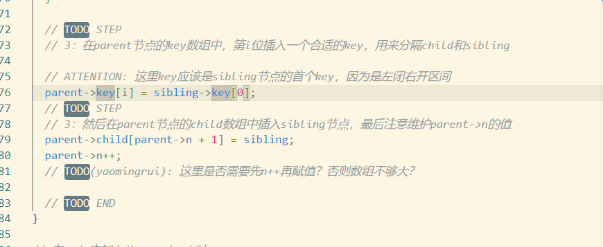

## todo 3

第1次插入之前应该分裂第1个子节点，但是分裂节点中出现段错误

发现是因为insertToNode函数判断子节点为满时给分裂节点传入的parent参数为子节点，但是此时子节点可能为叶子节点，没有child，所以child为空，访问出现段错误，修改为传入node作为parent即可

还有情况是：

经过分析发现，这个应该是在level11最后插入键值对之后变成7个键值对，所以应该分裂

原来是插入，我直接写成更改了，导致插入351879620之后分裂，然后level1的节点就错了

b+树的叶子节点的上一层key是其对应子树的最小key，其他非叶子节点的key是它指向的两个非叶子节点的中间key